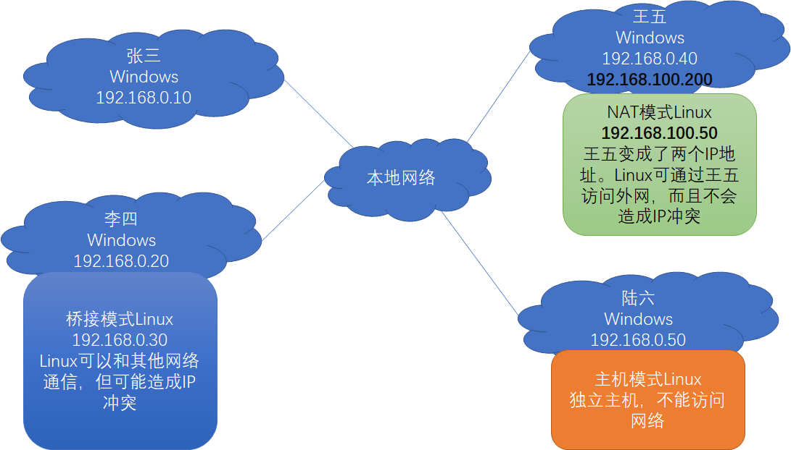

# Linux 学习笔记

## 安装

1. 下载并安装 VirtualBox

2. 安装 Ubuntu。可以选择 desktop 版和 server 版的，学习时可以先使用 desktop 版过度下。

   在安装时，选择 RAM 和硬盘要稍微大点，不然会出现安装时键盘无法输入的情况。安装时，若出现窗口太小问题，使用`Alt+F7`拖动窗口。Linux 系统的分区主要有：

   1. 启动分区`/boot`，用于启动 Linux 系统
   2. swap 分区，主要当作虚拟内存
   3. 根分区`/`

## 虚拟机的网络模式

网络模式主要有桥接模式/NAT 模式/主机模式。各个模式的区别主要见上图。上图中，本地网络是 192.168.0.xx 网段，李四/王五/陆六分别创建了 Linux 虚拟机。根据网络模式的区别，虚拟机与主机即本地网络的网络连接行为不一致。

主要区别见下图：

|                   | NAT | 桥接 | Internal       | Host-Only    |
| ----------------- | --- | ---- | -------------- | ------------ |
| 虚拟机 → 主机     | √   | √    | ×              | 默认不需设置 |
| 主机 → 虚拟机     | ×   | √    | ×              | 默认不需设置 |
| 虚拟机 → 其他主机 | √   | √    | ×              | 默认不需设置 |
| 其他主机 → 虚拟机 | ×   | √    | ×              | 默认不需设置 |
| 虚拟机之间        | ×   | √    | 同网络名下可以 | √            |
